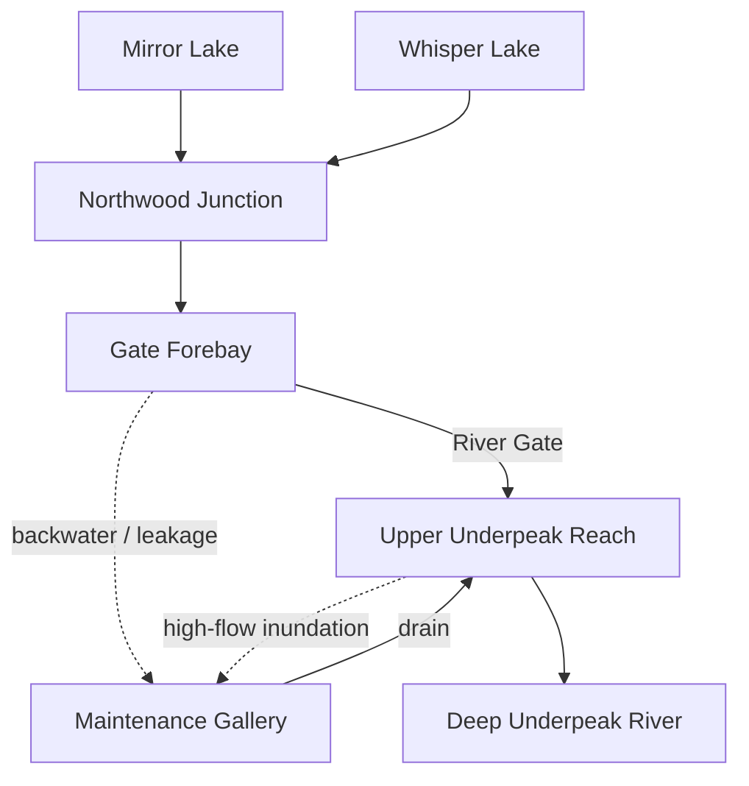

# WORLD ZERO — THE SILVER THREAD

## Hydrology & Shared-State Model v0.1

**Status:** DRAFT / experimental companion specification, not CANON  
**Date:** 2026-08-07  
**Parent:** `WORLD_ZERO_SILVER_THREAD_V0_1.md`  
**Technical base:** V0.0-D.1.4.1 — The Ways of Knowing  
**Purpose:** lock the first mathematically defined shared causal machine before implementation

---

# 0. The design decision

The `Sealed River Gate` is not a dungeon door and must never become a disguised quest switch.

For Silver Thread it is an old hydraulic structure whose state simultaneously affects:

- the two Northwood lakes;
- a hidden Northwood water junction;
- the old Underpeak waterworks;
- a human maintenance gallery that could become a trade route;
- an underground river reach;
- Nereid's ability to regain aquatic continuity with her native waters;
- erosion beside an already-existing buried funerary site.

The decisive rule is:

> **No system owns the story. They only own their part of reality.**

Hydrology decides water. Route logic decides passability. Burial geometry decides exposure. Agents decide intentions. Perception decides who learns what.

The same object can therefore be:

- a blockage to Nereid;
- infrastructure to Trade House;
- an ecological risk to Nature;
- irrelevant to Death until something death-relevant becomes perceptible;
- a piece of strange machinery to Arra.

No one receives the table above in-world.

---

# 1. Non-negotiable invariants

1. `underpeak_river_gate.condition == "sealed"` is a descriptive starting label, not authoritative future logic.
2. Gate state is continuous and historical; it cannot be represented only by `open/closed`.
3. Water is conserved inside the focal model after explicit sources, sinks and spill are accounted for.
4. Opening the Gate never directly calls Nereid, Trade, Nature, Death, the Cult or a quest system.
5. Hydrology never decides that an exposed burial is a sacrilege, omen or archaeological discovery.
6. The burial shelf exists at seed time whether or not anyone ever discovers it.
7. Nereid's desired water state is not automatically Nature's desired water state.
8. Trade House should care about route conditions, not about a magic `gate_position == profitable` number.
9. Nature observes ecological consequences through its epistemic boundary; it does not receive the hydrology state object.
10. God of Death does not know `underpeak_burial_shelf` merely because the server knows it or because it belongs to the death domain.
11. The player may leave Silver Thread completely alone. The machine still ticks.
12. Any threshold event must be derivable from continuous prior state, not from a story beat counter.

---

# 2. Exact focal topology

The v0.1 focal model has **seven water-storage nodes**. External catchments and the distant downstream sink are boundary conditions, not simulated regions.



The seventh node is the Maintenance Gallery itself: it holds a small amount of water and its water depth matters for human passage.

Two important non-node facts are attached to this graph:

- `nereid_01` begins associated with `northwood_junction`, from which she can manifest weakly through connected northern waters;
- `underpeak_burial_shelf` is physically embedded beside `underpeak_upper_reach`.

The choice of `northwood_junction` solves an important world-logic problem: silver-water activity in either Mirror Lake or Whisper Lake can belong to the same connected water system without requiring the Nereid to teleport from one lake to another.

The later aqueous-echo system may propagate metaphysical signal across connected water with its own attenuation law. Hydrology does **not** implement the echo itself.

---

# 3. Prototype units and clock

This is a causal game model, not a civil-engineering simulator.

For v0.1:

- one world-process tick = **360 game minutes / 6 hours**;
- `storage` uses normalized **water units (WU)**;
- `flow` uses **WU per tick**;
- `level = storage / storage_capacity` and therefore lies in `[0, 1]` under normal storage;
- `head` is a dimensionless hydraulic proxy used only inside this focal model.

We deliberately do not label the prototype numbers as cubic metres or metres per second. False real-world precision would add nothing to the investor proof.

The model borrows three real mechanisms:

1. water storage follows an inflow/outflow balance;
2. gated flow depends on gate opening and hydraulic head difference;
3. changing flow and sediment conditions changes where erosion/deposition occurs.

Those mechanisms are physically grounded; the coefficients below are game-scale calibration parameters.

---

# 4. Node state

Each water node stores:

```text
node_id
storage
storage_capacity
base_head
external_inflow
external_loss
water_tags[]
```

Seed calibration:

| Node | ID | Capacity | Base head | Initial storage | Initial level | External inflow / tick |
| --- | --- | ---: | ---: | ---: | ---: | ---: |
| Mirror Lake | `lake_mirror` | 1.20 | 3.00 | 0.78 | 0.650 | 0.034 |
| Whisper Lake | `lake_whisper` | 1.00 | 2.90 | 0.68 | 0.680 | 0.030 |
| Northwood Junction | `northwood_junction` | 0.55 | 2.55 | 0.40 | 0.727 | 0.000 |
| Gate Forebay | `underpeak_gate_forebay` | 0.45 | 2.25 | 0.38 | 0.844 | 0.000 |
| Maintenance Gallery | `underpeak_gallery_sump` | 0.30 | 2.05 | 0.015 | 0.050 | 0.000 |
| Upper Underpeak Reach | `underpeak_upper_reach` | 0.60 | 1.85 | 0.33 | 0.550 | 0.030 |
| Deep Underpeak River | `underpeak_deep_river` | 0.85 | 1.45 | 0.53 | 0.624 | 0.020 |

Derived head:

```text
level_i = storage_i / capacity_i
head_i  = base_head_i + level_i
```

The external inflows represent catchment, spring and groundwater inputs outside the focal graph. They must be explicit in the trace so that water never appears from nowhere.

---

# 5. Ordinary edge flow and water balance

For an ordinary directed water edge `i → j`:

```text
q_ij = capacity_ij * clamp((head_i - head_j) / head_scale_ij, 0, 1)
```

Initial ordinary edges:

| From | To | Edge capacity | Head scale | Meaning |
| --- | --- | ---: | ---: | --- |
| `lake_mirror` | `northwood_junction` | 0.065 | 0.75 | natural seep / outlet |
| `lake_whisper` | `northwood_junction` | 0.060 | 0.75 | natural seep / outlet |
| `northwood_junction` | `underpeak_gate_forebay` | 0.115 | 0.65 | old intake channel |
| `underpeak_upper_reach` | `underpeak_deep_river` | 0.140 | 0.70 | natural underground river |

The Gate and Gallery use their own equations below.

Per node, before capacity spill:

```text
storage_raw[t+1]
    = storage[t]
    + external_inflow
    + sum(incoming_flows)
    - sum(outgoing_flows)
    - external_loss
```

If `storage_raw > capacity`, the excess becomes an explicit `spill_to_boundary` quantity. It is **not** silently clamped away.

If available water is smaller than requested outflow, outgoing transfers are proportionally/serially limited by the authoritative resolver. Negative storage is impossible.

The following focal-boundary losses provide a stable small-world calibration without pretending that the graph contains the entire watershed:

```text
mirror_boundary_loss  = 0.008 * level_mirror
whisper_boundary_loss = 0.007 * level_whisper

junction_boundary_loss =
    0.042 * clamp((level_junction - 0.52) / 0.26, 0, 1)

deep_boundary_outflow =
    0.090 * clamp(level_deep / 0.65, 0, 1)
```

Every one of these terms is configuration, not agent knowledge.

---

# 6. The River Gate is three physical state variables, not one story variable

`underpeak_river_gate` gains:

```text
sluice_position     # 0.0 closed -> 1.0 fully raised
debris_load         # 0.0 clear  -> 1.0 completely obstructed
structure_integrity # 0.0 failed -> 1.0 intact
```

Seed values:

```text
sluice_position     = 0.00
debris_load         = 0.35
structure_integrity = 0.82
```

The old string:

```text
condition = "sealed"
```

remains useful only as a derived/display description of the starting object.

Effective opening proxy:

```text
effective_opening = clamp(
    sluice_position * (1 - debris_load)
    + 0.03 * (1 - structure_integrity),
    0,
    1
)
```

The second term means a damaged ancient gate can leak even while nominally closed.

Gate discharge proxy:

```text
delta_head = max(0, head_forebay - head_upper)

q_gate = min(
    0.180,
    0.140 * effective_opening * sqrt(delta_head / 0.50)
)
```

The square-root/head/opening relationship is inspired by ordinary gate-discharge physics. It is dimensionless here and intentionally calibrated for the prototype.

Consequences of this representation:

- clearing debris can matter without moving the sluice;
- lifting the same sluice amount at two different water levels can produce different flow;
- damaging the structure can create leakage nobody intended;
- closing a damaged gate may fail to restore the previous state;
- the object's history matters.

That last point is crucial. A world with historical objects can remember causality without storing a story script.

---

# 7. Maintenance Gallery: why Trade wants a middle state

The human route runs beside the hydraulic structure rather than through the water channel itself.

It can flood from **both directions**:

1. too little Gate discharge causes upstream backwater/leakage from the Forebay;
2. too much discharge raises/splashes/seep-inundates the downstream side of the old gallery.

This creates a physically motivated middle range that Trade House can prefer without coding `trade_prefers_gate_30_percent = True`.

Upstream gallery inflow:

```text
q_gallery_backwater = min(
    0.055,
    0.018 * (1 - structure_integrity) * clamp(delta_head / 0.50, 0, 1)
    + 0.075 * max(0, level_forebay - 0.80)
)
```

Downstream gallery inundation after the old channel exceeds its safe conveyance band:

```text
q_gallery_downstream = min(
    0.050,
    4.0 * max(0, q_gate - 0.038)
)
```

The gallery also has `rubble_obstruction ∈ [0,1]`.

Seed:

```text
rubble_obstruction = 0.70
```

Drain capacity improves when rubble is removed:

```text
gallery_drain_capacity = 0.015 + 0.025 * (1 - rubble_obstruction)
```

Actual drain:

```text
q_gallery_drain = gallery_drain_capacity
    * clamp((level_gallery - 0.05) / 0.40, 0, 1)
```

Human route state is derived:

| Condition | Route consequence |
| --- | --- |
| `rubble_obstruction > 0.35` | physically blocked regardless of water |
| rubble clear + `gallery level < 0.18` | normally passable |
| `0.18 <= gallery level < 0.45` | wet/risky; higher cost and slower travel |
| `gallery level >= 0.45` | impassable without special intervention |

For the legacy D.1.4.1 engine, `underpeak.accessible` may temporarily be **derived** from whether at least one valid mortal route exists. It must not be flipped by a `QUEST_COMPLETE` event.

This gives Trade House a useful engineering option: clearing rubble both improves passage and improves drainage. It can accidentally make a higher-flow compromise with Nereid more feasible.

---

# 8. The Nereid's objective affordance is not her knowledge

`nereid_01` begins associated with `northwood_junction`.

Her native-water target is `underpeak_deep_river`.

For v0.1, a physically usable aquatic passage requires a sustained window in which all of the following are true:

```text
effective_opening >= 0.28
q_gate            >= 0.045 WU/tick
water_path_connected(northwood_junction, underpeak_deep_river) == true
```

The condition must hold for at least **two consecutive hydrology ticks** before the path is considered stably traversable.

This is an **authoritative affordance predicate**, not a quest trigger.

When it becomes true, the world does not move Nereid automatically and does not notify her magically. It only becomes physically possible for her to attempt passage if she perceives enough evidence and chooses to act.

Her initial subjective model should be imperfect. A useful seed hypothesis is:

> “A weaker restored current may be enough.”

For example, her remembered expectation may correspond roughly to `q ≈ 0.035`, while she does not know the exact present debris load or the changed ancient mechanism.

Therefore Nereid can:

- underestimate the work required;
- attempt passage too early;
- revise her hypothesis after failure;
- seek a different intervention;
- recruit Trade House or Arra;
- decide the risk is not worth it;
- succeed without ever involving the player.

The server validates whether she actually reaches the target. Her prose cannot declare success.

---

# 9. Nature's interest comes from ecology, not from Gate ownership

Nature gets no hard-coded `protect_gate` desire.

The ecology layer instead treats water-state bands as living-system inputs.

Initial calibration bands:

| Variable | Low-stress band |
| --- | --- |
| Mirror Lake level | `0.48–0.80` |
| Whisper Lake level | `0.52–0.82` |
| absolute daily lake-level change | `<= 0.08` |
| Upper Underpeak total flow | approximately `0.035–0.070 WU/tick` |

Deviation outside a band gradually changes ordinary ecological state such as shoreline habitat / aquatic health. It does not directly page God of Nature.

God of Nature may later perceive:

- a lake receding;
- an abrupt water shift;
- stressed aquatic life;
- unusual flow near a Presence anchor;
- mortal reports.

It may miss some or all of those observations depending on Presence, Attention, Herald routing and time.

Thus the server can know “Mirror Lake is at 0.43” while Nature only receives something like “the northern shallows have retreated unusually far.”

This preserves the core D.1.4.1 epistemic law.

---

# 10. Burial erosion is geometry, not prophecy

`underpeak_burial_shelf` is attached to the bank of `underpeak_upper_reach` at seed time.

For v0.1 the vulnerable bank lies just downstream of the Gate and **upstream of the Gallery's downstream flood off-take**. Therefore the discharge acting on that bank is defined explicitly as:

```text
q_upper_total = q_gate + upper_reach_external_spring_inflow
```

with the seed spring contribution equal to `0.030 WU/tick`. This prevents a flooded side gallery from paradoxically erasing the high-flow stress that caused it to flood.

Initial authoritative state:

```text
cover_depth_equiv  = 0.55
sediment_mobility  = 1.00
exposure_fraction  = 0.00
disturbance         = 0.00
remains_displaced  = false
```

Use that actual local discharge, not a story flag:

```text
erosion_load = max(0, (q_upper_total - 0.070) / 0.010)

cover_loss =
    0.004 * (erosion_load ** 1.5) * sediment_mobility
```

At low flow, slow deposition may rebuild cover:

```text
deposition =
    0.00025 * max(0, (0.050 - q_upper_total) / 0.010)
```

Then:

```text
cover_depth_equiv[t+1] = clamp(
    cover_depth_equiv[t] - cover_loss + deposition,
    0,
    0.75
)

exposure_fraction = clamp(
    (0.12 - cover_depth_equiv) / 0.12,
    0,
    1
)
```

This intentionally makes burial exposure a **sustained-history phenomenon**. One dramatic Gate action should usually not expose a tomb instantly.

Possible interventions can change the physics without knowing the hidden burial exists:

- reinforcing the riverbank lowers `sediment_mobility`;
- reducing flow stops further erosion;
- altered sediment supply can redeposit cover;
- sufficiently strong flow after exposure can displace remains and create an irreversible scar.

Therefore even a high-flow Nereid success does **not** guarantee a tomb discovery.

That is a central anti-script test.

---

# 11. The deliberately incompatible state space

The machine is authored to contain tension, not an authored outcome.

With initial infrastructure approximately intact, the useful bands should be calibrated toward:

| Hydraulic regime | Nereid | Trade gallery | Surface ecology | Burial shelf |
| --- | --- | --- | --- | --- |
| Gate essentially sealed | no aquatic passage | backwater + rubble make route poor | lakes relatively high/stable | stable |
| low opening | still insufficient | improving | usually tolerable | stable |
| moderate opening | perhaps close, often still insufficient | **best default range** | usually tolerable | usually stable |
| sustained high opening | **passage can become viable** | downstream flooding risk | lake drawdown risk | erosion can accumulate |

This table is a **calibration expectation**, not branching logic.

No resolver may ask which row it is in and then emit the associated narrative consequence. Every cell must be computed from lower-level state.

More importantly, the incompatibility is **transformable**:

- Trade can clear the Gallery drain and tolerate more water;
- someone can reinforce the vulnerable bank;
- actors can use timed/seasonal Gate openings rather than a permanent state;
- the Gate can be repaired, damaged or jammed;
- Nereid can revise what she considers an acceptable route;
- Nature can tolerate a temporary disturbance or oppose it;
- a costly bypass can eventually become rational.

There is no mandated tragedy and no mandated harmony.

---

# 12. Initial knowledge: truth must fragment immediately

| Subject | May initially know / perceive | Must **not** initially receive |
| --- | --- | --- |
| `nereid_01` | her local water signature; memories of native Underpeak water; evidence that continuity is broken | exact graph, Gate coefficients, current debris/integrity, burial shelf, Trade project |
| `trade_house_01` | old records that a service gallery/waterwork once linked northward; commercial value of a route | current hydraulic state everywhere, Nereid's motive, burial shelf, Gods' beliefs |
| God of Nature | whatever lake/ecology evidence crosses Presence/Attention/Herald boundaries | node table, exact thresholds, Nereid's private Project, future consequences |
| God of Death | ordinary death-domain percepts that actually reach it | buried site's object ID or truth merely because it exists |
| `last_gate_cult_01` | its doctrine, mortal records, reports actually delivered | Death's internal beliefs, objective Ledger, hidden burial truth |
| Arra | current player-visible geography/inventory and personally acquired evidence | water graph, Nereid Project, hidden metaphysics, burial shelf |

An actor may later infer a surprisingly accurate model. That is allowed.

The prohibition is against the server giving it the answer key.

---

# 13. Minimal physical affordances

The hydrology slice needs a small generic action vocabulary rather than authored quest actions.

## Observe / inspect

```text
inspect_water_state(target)
inspect_gate()
survey_gallery()
```

These create subjective observations with uncertainty appropriate to the observer and tools.

## Change the Gate

```text
adjust_sluice(delta)
clear_gate_debris(effort)
force_sluice(delta)
repair_gate(effort/materials)
```

Normal adjustment can fail if debris/resistance is too high. `force_sluice` may obtain more movement while damaging `structure_integrity`.

## Change the Gallery

```text
clear_gallery_rubble(effort)
repair_gallery_drain(effort/materials)
```

These change route/drain state, not Trade's profit directly.

## Change the bank

```text
reinforce_bank(target_reach, effort/materials)
```

If applied at the relevant reach it lowers sediment mobility. The actor does not need to know a burial is inside the bank.

## Lesser-entity water influence

Nereid may receive one constrained local affordance such as:

```text
shift_local_silt(target_edge, bounded_effort)
```

It can modestly change debris/sediment state. It cannot set `q_gate`, teleport through a closed structure, reveal hidden server state or declare the Project complete.

All actions require location/reachability, time and physical resources where appropriate.

---

# 14. A route becoming possible is not a quest event

The runtime may derive meaningful state transitions such as:

```text
AQUATIC_ROUTE_BECAME_VIABLE
AQUATIC_ROUTE_BECAME_NONVIABLE
GALLERY_ROUTE_BECAME_PASSABLE
GALLERY_ROUTE_BECAME_IMPASSABLE
LAKE_LEVEL_BAND_CROSSED
BURIAL_COVER_BECAME_EXPOSED
REMAINS_DISPLACED
```

These are **objective state-transition events**.

They do not automatically:

- notify any agent;
- assign importance;
- create a quest;
- create a belief;
- make a God angry;
- tell the Cult what the event means.

They enter the objective Ledger with causal provenance. Separate perception systems decide whether anybody notices them.

This distinction lets Creator View later say:

```text
Gate adjustment
→ hydraulic head changed
→ flow rose for 19 ticks
→ cover depth fell below exposure geometry
→ burial became physically visible
→ worker witnessed something
→ worker report travelled
→ Cult interpreted report
```

without ever encoding the whole chain as one rule.

---

# 15. Causal provenance requirements

Every hydrology process tick should retain enough information to reconstruct important transitions without logging an unreadable event for every float operation.

Internal process trace:

```text
hydrology_tick_id
game_minute
input_state_hash
external_source_totals
edge_flows
external_sink_totals
spill_totals
output_state_hash
causal_action_event_ids[]
```

Meaningful Ledger events refer back to the tick(s) that caused their threshold crossing.

For a Gate action:

```text
subject decision
→ intent/action
→ authoritative Gate resolver
→ GATE_ADJUSTED event
→ hydrology tick(s)
→ derived physical event
```

For passive history such as gradual erosion, the causal parent should point to the accumulated relevant process window / state-transition record rather than inventing a single actor as “the cause.”

Creator View may summarize many ticks, but the raw forensic path remains recoverable.

---

# 16. Prehistory and experiment branching

Do not confuse physical calibration with autonomous prehistory.

## A. Hydrology calibration fixture

Run the water machine alone for at least 120 ticks = 30 virtual days.

Acceptance:

- no unexplained mass gain/loss;
- no numerical oscillation/explosion;
- sealed ancient infrastructure approaches a plausible stable/backwater state;
- buried shelf does not spontaneously become exposed under baseline flow;
- tiny integrity leakage does not create Nereid passage.

## B. Autonomous prehistory

Then run the actual world for approximately 30 days with Nereid, Trade House and world processes active.

The player is absent.

At the end, take a **branch snapshot T0**.

All controlled Silver Thread Arms A–E fork from the same T0 state. That means their history before Arra's counterfactual action is literally identical.

If Trade House surveyed something or Nereid tried something during prehistory, that remains in the common history rather than being reset for convenience.

This is much stronger evidence than separately seeding five “similar” worlds.

---

# 17. Falsification tests for this subsystem

The hydrology design is not accepted merely because it produces a dramatic demo.

It fails if any of the following is true:

1. `gate_opened -> burial_exposed` exists as direct application logic.
2. `gate_opened -> underpeak.accessible = True` exists without evaluating an actual route.
3. Nereid learns the Gate numbers from the server instead of observation/inference.
4. Death learns the hidden burial because the object carries a `death` tag.
5. high Gate flow always exposes the burial regardless of duration, sediment state or reinforcement.
6. Trade profitability directly reads `sluice_position` instead of physical route/cost state.
7. Nature directly reads lake-state arrays rather than percepts.
8. the same world/action seed produces unexplained nondeterministic physical results.
9. water disappears because a node was silently clamped at capacity.
10. player refusal pauses the world process.

Positive counterfactual tests should demonstrate that:

- moderate Gate adjustment can improve the human route without satisfying Nereid;
- sufficient sustained water can satisfy the Nereid passage predicate while harming Trade under an uncleared Gallery;
- clearing the Gallery drain can make a formerly incompatible state compatible;
- bank reinforcement can prevent burial exposure under a flow that would otherwise expose it;
- brief high flow can end before sufficient erosion accumulates;
- the Gate can be damaged into a leaky state that persists after someone tries to close it;
- Nereid can remain blocked even after a mortal believes they “opened the gate.”

Those are system tests, not stories to force in live runs.

---

# 18. Minimal D.1.4.1 integration seams

The current code already gives us useful anchors:

- `lake_mirror` and `lake_whisper` are `WorldObject(kind="lake")` in `northwood`;
- `underpeak_river_gate` is a `WorldObject(kind="river_gate")` in `underpeak`;
- Underpeak is currently `Region(accessible=False)`;
- Arra already owns `silver_rod`;
- `FISH` already records the lake and tool used;
- the Ledger already carries objective event causality.

Recommended implementation boundary:

```text
worldzero/processes/
    runtime.py
    hydrology.py

HydrologyState
WaterNodeState
WaterEdgeState
GateHydraulicState
GalleryState
BurialBankState
```

Do **not** put the authoritative hydraulic machine into an LLM prompt or into `WorldObject.properties` as an unstructured dumping ground merely because `properties: dict[str, Any]` currently permits it.

For the first prototype, existing `WorldObject` IDs can reference explicit subsystem state.

`WorldState.advance()` eventually needs `WorldProcessRuntime` integration so a six-hour process boundary cannot be accidentally skipped when time advances by a large amount.

Legacy `underpeak.accessible` should become a derived compatibility value until travel itself is route-based.

The existing `FISHED` event is already enough for the later metaphysical system to know that silver physically contacted a particular lake. No Nereid logic belongs inside `_fish()`.

---

# 19. What is deliberately not in Hydrology v0.1

Do not add yet:

- rainfall simulation;
- seasons;
- groundwater PDEs;
- realistic fluid velocity fields;
- water quality chemistry;
- dozens of river branches;
- procedural watersheds;
- full sediment grain-size modeling;
- naval movement;
- fishing ecology rewrite;
- God-specific hydraulic rules.

Those can all become interesting later. None are necessary to prove autonomous causal history.

---

# 20. Why this machine is generative

The most important result of this specification is not a number. It is the shape of the possibility space.

A high-flow intervention can help Nereid and hurt Trade — unless Trade previously cleared drainage.

It can threaten a burial — unless somebody reinforced a bank for completely unrelated reasons.

Closing the Gate can protect the lakes — unless the structure was already damaged and now leaks.

Trade House can become Nereid's ally for one phase because both want the old infrastructure restored, then become her opponent when their preferred end states diverge.

Nature can oppose Nereid without being evil and help her later without changing personality.

Death can intervene late, based on incomplete evidence about an event whose remote physical cause was a water-management decision weeks earlier.

Arra can cause none of it, some of it, or make one small intervention that changes which of these latent conflicts ever becomes historical.

That is exactly what Silver Thread is meant to prove.

---

# 21. Real-world mechanism notes

These sources justify the physical *shape* we borrow. They do not claim the normalized coefficients above are engineering predictions.

## Water balance

USGS describes the lake water-budget concept as inflows/outflows plus or minus change in storage. That is the conservation backbone of the node update here.

Source: https://www.usgs.gov/publications/hydrological-processes-and-water-budget-lakes

## Gate discharge

U.S. Bureau of Reclamation material on gated-channel discharge describes flow rate as depending chiefly on upstream head, downstream head and gate opening; gate-calibration equations use an opening/area term with a square-root head relationship. Silver Thread compresses that structure into a dimensionless proxy.

Sources:

- https://www.usbr.gov/tsc/techreferences/hydraulics_lab/pubs/PAP/PAP-1062.pdf
- https://www.usbr.gov/tsc/techreferences/hydraulics_lab/pubs/PAP/PAP-0937.pdf

## Flow, sediment and erosion/deposition

USGS notes that river sediment transport depends on flow and sediment supply, and that changes in these alter where erosion or deposition occurs. Silver Thread uses that causal dependency but intentionally reduces it to accumulated bank-cover state.

Source: https://www.usgs.gov/centers/southwest-biological-science-center/science/river-sediment-dynamics

---

# 22. Lock for the next implementation stage

Unless a later test shows a contradiction, Hydrology v0.1 locks these design facts for the vertical slice:

1. `northwood_junction` is Nereid's current water anchor.
2. `underpeak_deep_river` is the native-water target.
3. the focal graph has seven storage nodes.
4. Gate truth is `sluice_position + debris_load + structure_integrity`, not `open/closed`.
5. the human Gallery is parallel infrastructure whose flood state is derived from both upstream backwater and excessive downstream flow.
6. Trade's preferred state emerges from route conditions.
7. Nereid requires stronger sustained connectivity than Trade normally prefers at the seed infrastructure state.
8. surface ecology becomes stressed if the Northwood system is drained too aggressively.
9. the burial shelf is pre-existing geometry whose exposure requires accumulated erosion.
10. engineering can transform the conflict space; no zero-sum ending is mandatory.

The next code written for Silver Thread should be able to use these facts without containing any knowledge of a future story.

---

# Final formula

The Gate is not:

> a switch that unlocks Underpeak.

It is:

> **an old object with water on both sides, damage in its body, debris in its throat, people wanting different things from it, and consequences that belong to physics before they belong to story.**

That is the first real shared-state machine of `The Silver Thread`.
